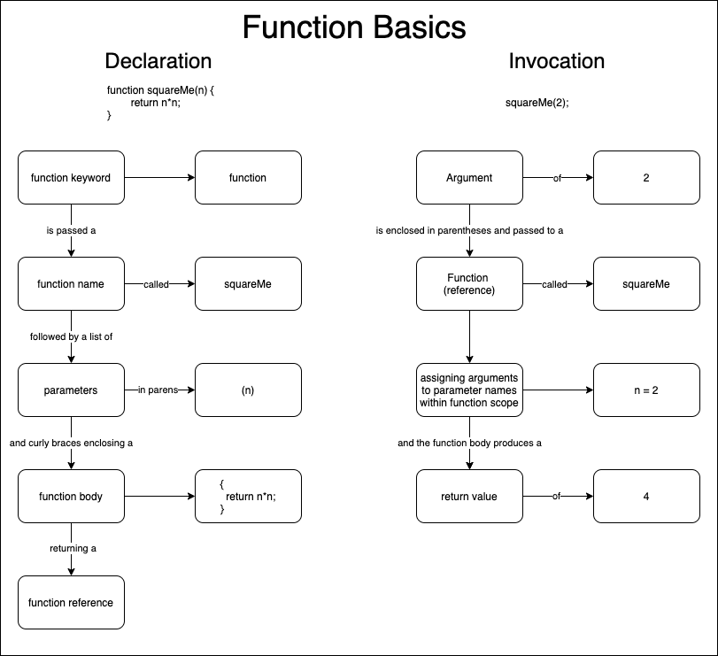
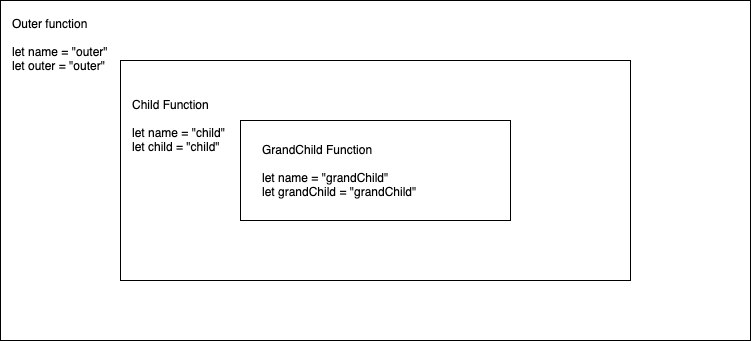

# JS Functions

## Goals

- Understand the importance of functions in JS and the nuances of how functions work
- Discuss what is meant by first-class function and why it matters
- Cover the many ways that functions can be used in JS because they are first-class
- Introduce students to arrow functions and the differences between arrow and regular functions

## Topics

- Declaring vs invoking functions 📌
- Arrow Functions 💡
- Function Scope 📌
- First Class Functions 🤓
- Callback Functions 💡

## Emoji Legend

- 📌 - Essential to know deeply at this point, worth stopping to solidify
- 💡 - Important to know, but OK to revisit as you progress
- 🤓 - Useful to know for interviews and edge cases but less often used in day-to-day practice
- 📅 - preview of what's coming up


📌📌📌📌📌📌📌📌📌📌📌📌📌📌📌📌📌📌📌📌📌📌
## Difference Between Declaring and Invoking a Function
📌📌📌📌📌📌📌📌📌📌📌📌📌📌📌📌📌📌📌📌📌📌

- Declaring a function returns a function reference
- Invoking a function runs the function body and returns a value
- When a function is declared:
  - the expression returns a function reference. 
  - The function body **does not** run at this time but is stored with the function reference for later use.
- When a function is invoked (by appending `()` to the function reference)
  - the arguments are assigned to values for its parameters (in order) 
  - the function body executes until the body is complete or the function returns a value.



📌📌📌📌📌📌📌📌📌📌📌📌📌📌📌📌📌📌📌📌📌📌

--- 

💡💡💡💡💡💡💡💡💡💡💡💡💡💡💡💡💡💡💡💡💡💡
## Arrow Functions
💡💡💡💡💡💡💡💡💡💡💡💡💡💡💡💡💡💡💡💡💡💡

```js
const squareMe = (n) => n*n;
```

> In example above, `n*n` is implicitly returned as the arrow (`=>`) points to a single expression without a code block.
```js
const squareMe = (n) => {
  return n*n;
}
```
> In this example, the `return` keyword is required because we have included a code block (`{}`) following the arrow (`=>`)

🤓 There are some [differences between arrow functions and regular function declarations](https://dmitripavlutin.com/differences-between-arrow-and-regular-functions/) which come into play when working with Object Oriented JavaScript. We'll be using them interchangeably at the moment and you can too. Understanding the difference in how returns work is sufficient for now. 🤓

💡💡💡💡💡💡💡💡💡💡💡💡💡💡💡💡💡💡💡💡💡💡

---

📌📌📌📌📌📌📌📌📌📌📌📌📌📌📌📌📌📌📌📌📌📌
## Function Scope
📌📌📌📌📌📌📌📌📌📌📌📌📌📌📌📌📌📌📌📌📌📌

[JavaScript identifier lookup](https://www.demo2s.com/javascript/javascript-identifier-lookup.html) will look from the current block scope for a variable and continue exploring parent scopes until the variable is found. If not, we'll get a referenceError indicating that the variable is not defined.



From the `grandChild` function's scope, the `outer` and `child` variables are both accessible. But, the `name` variable within `grandChild` will refer to `'grandChild'`. The `name` variable is found within the `grandChild` scope, so the identifier lookup will stop there.

Identifier lookup travels up the scope chain, but **not** down. From the `outerFunction` scope, the `child` and `grandChild` variables are not accessible because they are defined further down the scope chain.

> The main practical takeaway for us now is to be careful when you name variables. In most cases, it's best to **avoid reusing the same variable name at different scopes for clarity's sake**.

📌📌📌📌📌📌📌📌📌📌📌📌📌📌📌📌📌📌📌📌📌📌

🤓🤓🤓🤓🤓🤓🤓🤓🤓🤓🤓🤓🤓🤓🤓🤓🤓🤓🤓🤓🤓🤓
## Hoisting
🤓🤓🤓🤓🤓🤓🤓🤓🤓🤓🤓🤓🤓🤓🤓🤓🤓🤓🤓🤓🤓🤓

All function declarations with the following syntax are hoisted to the top of the scope.

```js
canBeCalled()

function canBeCalled() {
  console.log('can I be called from here?')
}
```

Any other method of defining a function in JS (arrow, anonymous, using `var`, `let`, or `const`) will not be hoisted.

```js
cannotBeCalled()

const cannotBeCalled = () => {
  console.log('can I be called from here?)
}
```

We generally don't use this feature consciously, preferring to actually define functions before we invoke them.

🤓🤓🤓🤓🤓🤓🤓🤓🤓🤓🤓🤓🤓🤓🤓🤓🤓🤓🤓🤓🤓🤓

---

🤓🤓🤓🤓🤓🤓🤓🤓🤓🤓🤓🤓🤓🤓🤓🤓🤓🤓🤓🤓🤓🤓
## First Class/Higher Order functions
🤓🤓🤓🤓🤓🤓🤓🤓🤓🤓🤓🤓🤓🤓🤓🤓🤓🤓🤓🤓🤓🤓

The phrase First Class functions refers to the idea that functions in JavaScript are first class objects. This means that we can pass them as arguments to other functions and we can also return them from other functions. This

Higher Order functions are functions that fit one of the following criteria:

1. They accept another function as an argument
2. Their return value is another function

Of the two, you'll see the first much more often. The function that we pass as an argument is called a callback function.

> **Key Takeaway**: Unlike all languages, JS Functions are first class objects. This means we can store references to them, pass them as as arguments to other functions, return them from other functions, store them as properties of another object and more. Basically, they retain the same basic features as other types of objects in JS. 

🤓🤓🤓🤓🤓🤓🤓🤓🤓🤓🤓🤓🤓🤓🤓🤓🤓🤓🤓🤓🤓🤓

💡💡💡💡💡💡💡💡💡💡💡💡💡💡💡💡💡💡💡💡💡💡
## Callback Functions
💡💡💡💡💡💡💡💡💡💡💡💡💡💡💡💡💡💡💡💡💡💡

The functions that are passed as arguments to other functions are referred to as callback functions. We'll be using them extensively throughout the rest of the course as they offer a lot of flexibility that we can use to control how our code behaves.

There are many different functions built into JavaScript that accept callback functions as arguments. We'll only be using a couple of them today. The `setTimeout` function takes two arguments: a callback function and the number of milliseconds to wait before invoking the callback. After the time elapses, the callback function is invoked.

```js
console.log('starting now');
window.setTimeout(() => {
  console.log('2 seconds later')
}, 2000);
```

While we can also use named functions as callbacks, like so:

```js
function callback() {
  console.log('2 seconds later')
}
console.log('starting now');
window.setTimeout(callback, 2000);
```

It is much more common to see anonymous functions defined directly within the parameters list like in the first example.

💡 The `setInterval` method returns an `intervalID` that can be used to stop the interval from continuing to run by invoking the `clearInterval` method.

```js
let counter = 10;
const interval = window.setInterval(() => {
  console.log(counter);
  if(counter === 0) {
    window.clearInterval(interval);
  }
  counter--; 
}, 1000);
```

📅 Another common use case for callbacks that we'll explore more tomorrow is iteration. Later on, we'll be looking at how we can use callbacks to handle browser events (like clicks) as well. 📅

💡💡💡💡💡💡💡💡💡💡💡💡💡💡💡💡💡💡💡💡💡💡

🚧 🚧 🚧 🚧 🚧 🚧 🚧 🚧 🚧 🚧 🚧 🚧 🚧 🚧 
## Tasks for the Day
🚧 🚧 🚧 🚧 🚧 🚧 🚧 🚧 🚧 🚧 🚧 🚧 🚧 🚧 

1. Create a variable called `currentSong` that will hold the current song.
2. Create a function called `formatDuration` that will take a number of seconds as an argument and return a string containing minutes and seconds. 
3. Create a function called `playSong` that will take a song as an argument and set `currentSong` to the argument passed.

🚧 🚧 🚧 🚧 🚧 🚧 🚧 🚧 🚧 🚧 🚧 🚧 🚧 🚧 


📅 📅 📅 📅 📅 📅 📅 📅 📅 📅 📅 📅 📅 📅 

## Coming up in Lecture 3

📅 📅 📅 📅 📅 📅 📅 📅 📅 📅 📅 📅 📅 📅 

For Lecture 3, we'll be exploring Arrays in more depth and how we can use them in a program. 

📅 📅 📅 📅 📅 📅 📅 📅 📅 📅 📅 📅 📅 📅 

# Bonus Stuff
## Closure
🤓🤓🤓🤓🤓🤓🤓🤓🤓🤓🤓🤓🤓🤓🤓🤓🤓🤓🤓🤓🤓🤓

Closure is used under the hood to make a lot of libraries work, but you can get a lot done without using it in your code at all.

One practical example of how closure could be used is a template function. 

Let's say we want to be able to create multiple reusable templates that we can use to create different kinds of posts.

Each template will contain a `?` character that will be replaced by whatever data we want to display in the template.

We want to create a generator function that can take in a template as an argument and return a function that will insert data into that template.

The returned function creates a closure over the `template` value passed as an argument to `templateFn` so that the returned function maintains access to `template` even after the `templateFn` has returned.

```js
function templateFn(template) {
  return function(data) {
    // return a new string based on the template with the ? replaced by the value passed as an argument for the data parameter
    return template.replace('?', data);
  }
}

const pizzaTime = templateFn("? says: It's Pizza Time!")

console.log(pizzaTime("Dakota"))
console.log(pizzaTime("Sandra"))
```
🤓🤓🤓🤓🤓🤓🤓🤓🤓🤓🤓🤓🤓🤓🤓🤓🤓🤓🤓🤓🤓🤓

